# Novitas 백엔드 — 기능별 흐름 (도식)

브라우저·MCP는 **Nest만** 호출한다. FastAPI는 **내부 HTTP**·`X-Internal-Key`로만 연결된다. 아래 각 절마다 **단계 번호**가 그 기능 안에서의 순서이다.

---

## 1. 인증 (Auth)

로그인·세션·`/me`·대시보드 가드까지 한 흐름.

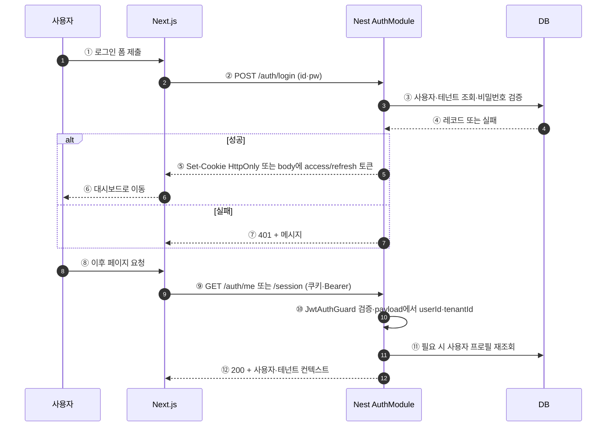

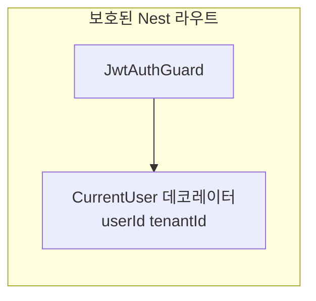

---

## 2. MCP (도구 목록·호출)

MCP 클라이언트는 **Nest 베이스 URL**만 알고, 도구 이름은 **레지스트리**에서 FastAPI 경로로 매핑된다.

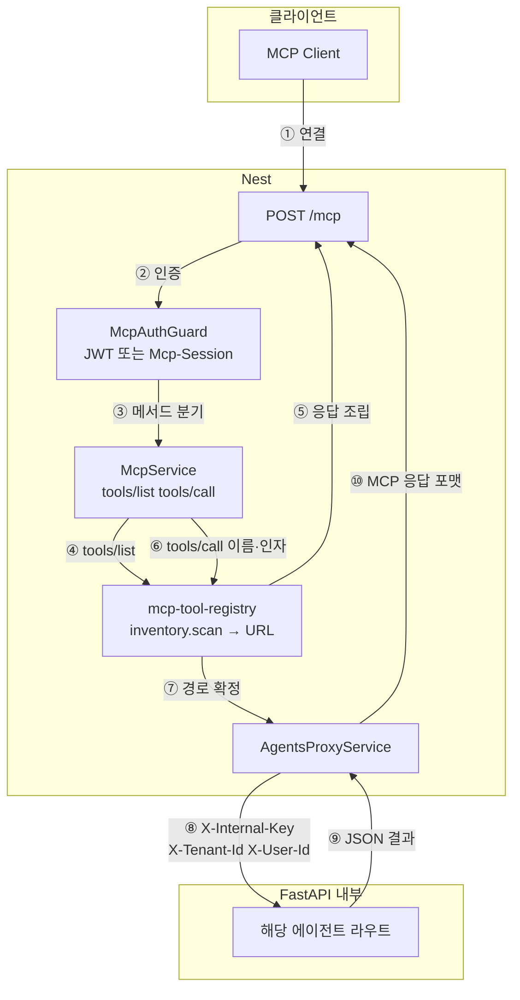

---

## 3. 재고 조회 (Inventory)

**경로 A: 대시보드 REST**와 **경로 B: MCP 도구**가 합쳐진 그림. 연산 본체는 FastAPI `inventory` 에이전트.

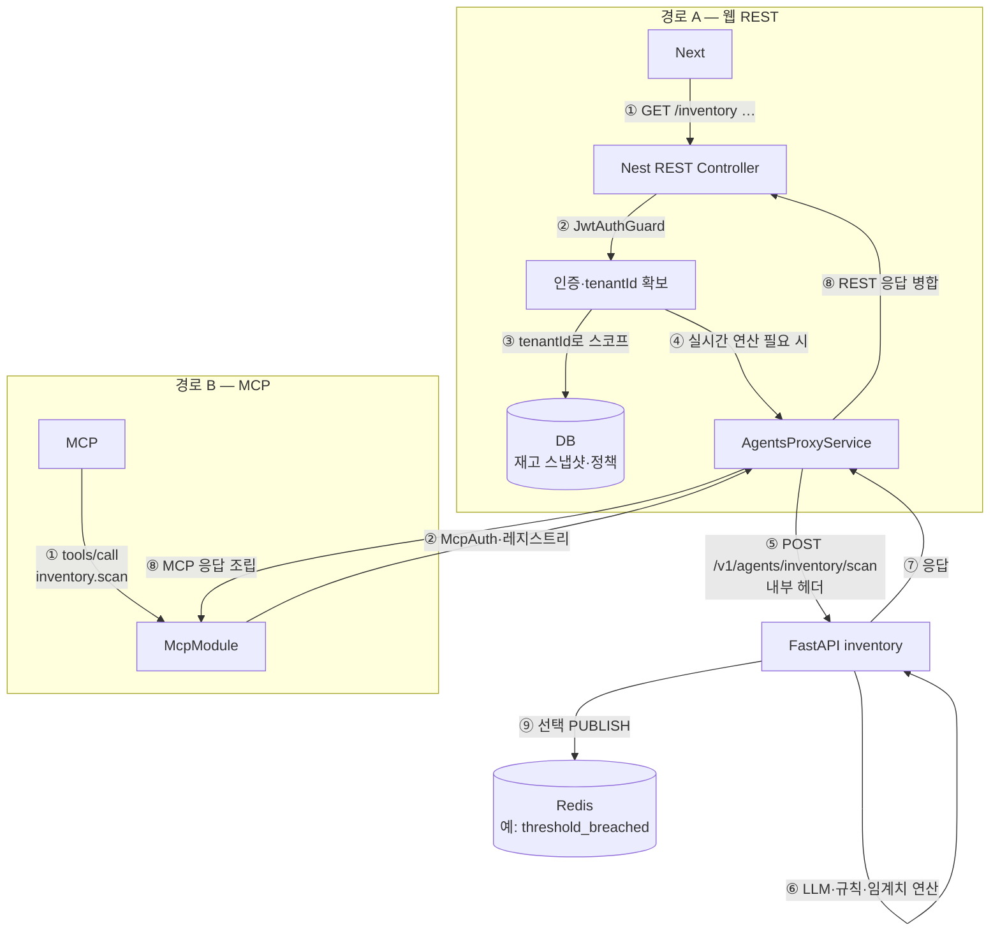

---

## 4. 발주 (Order)

발주 생성·시뮬레이션·외부 마켓 연동은 도메인에 따라 Nest DB와 FastAPI가 나뉜다. **주문의 진실한 상태**는 보통 Nest DB에 둔다.

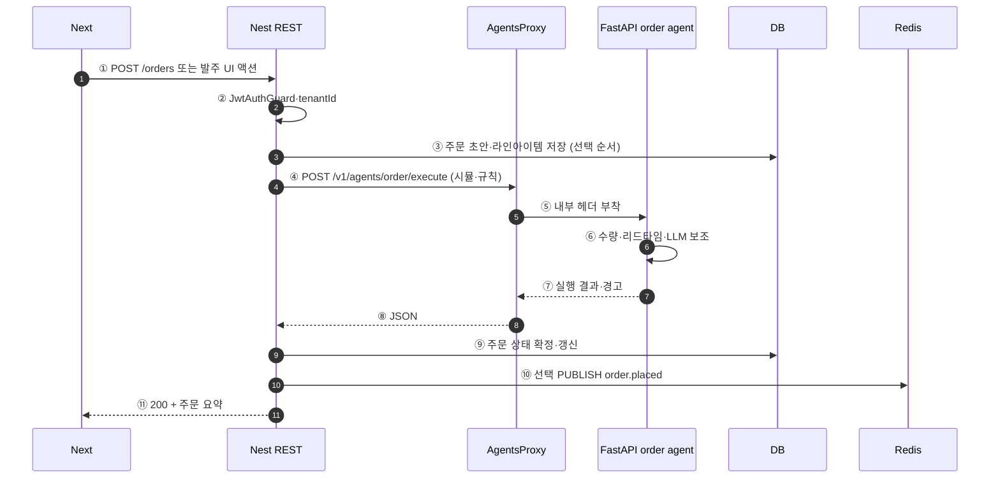

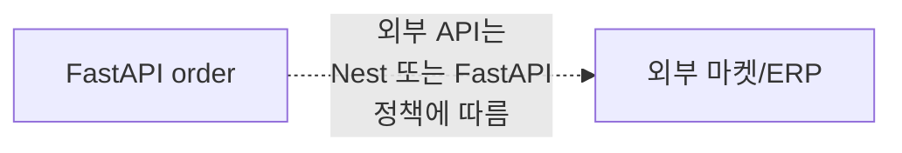

---

## 5. 결제 (Payment)

토스와 **직접 HTTP**하는 것은 **Nest만**. FastAPI `payment` 에이전트는 **판단·한도**만.

### 5-1. 사용자 수동 결제 (위젯 → 승인)

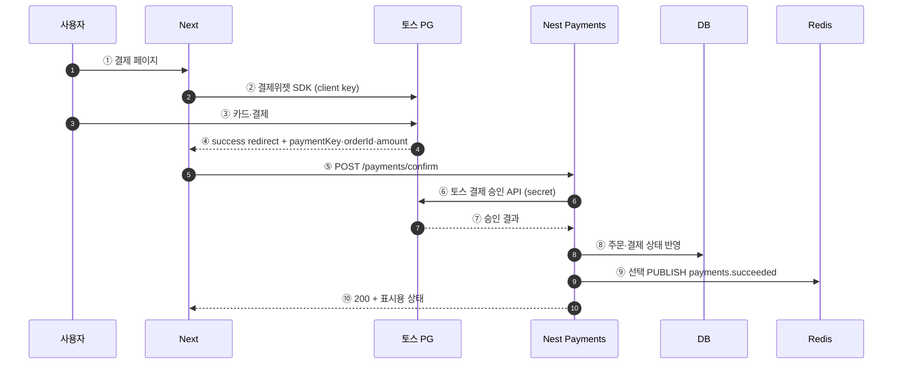

### 5-2. 토스 웹훅 (보완·동기화)

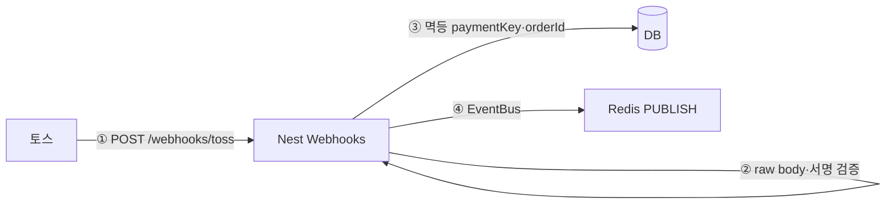

### 5-3. 에이전트 자동 결제 (판단은 FastAPI, PG는 Nest)

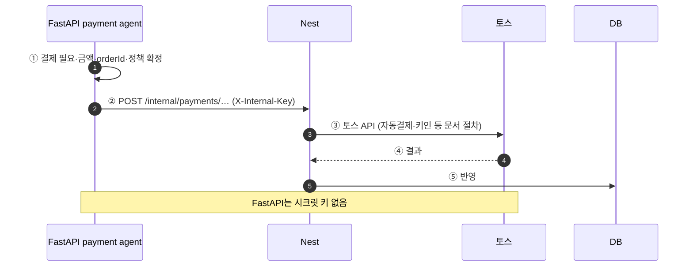

---

## 6. 감사 (Audit)

로그 검증·요약·이상 탐지는 FastAPI `audit` 에이전트, **저장·조회 API**는 Nest 쪽에 둘 수 있다.

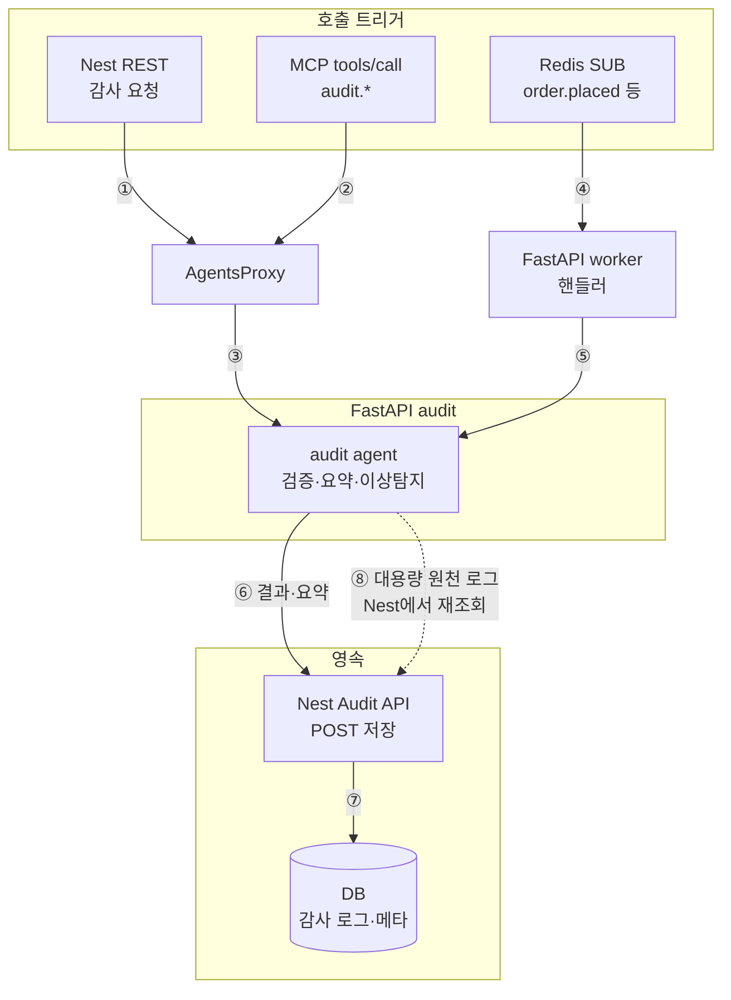

---

## 7. AI 채팅 (ai-proxy)

기존 채팅은 Nest가 **프록시**로 FastAPI에 연결한다.

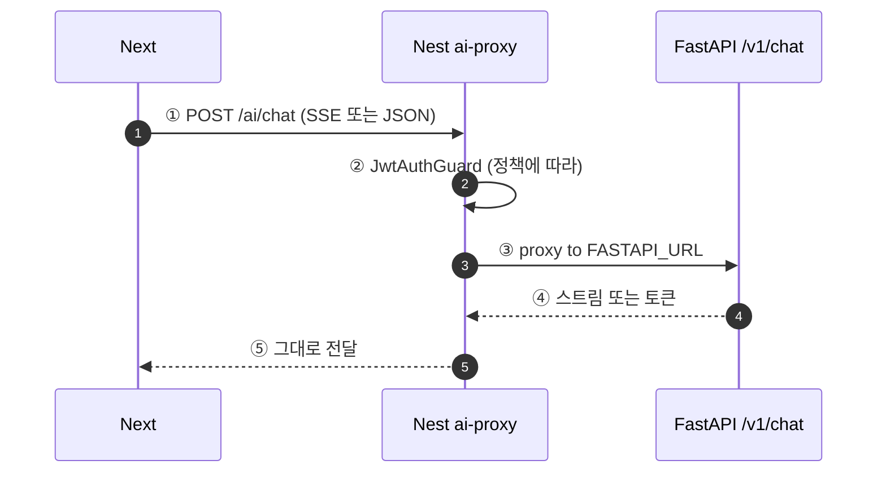

---

## 8. Redis 이벤트·후속 처리 (비동기)

HTTP **동기 응답**과 달리, pub/sub은 **방송**이며 리스너가 꺼져 있으면 메시지를 못 받을 수 있다. **반드시 남길 데이터는 DB 먼저.**

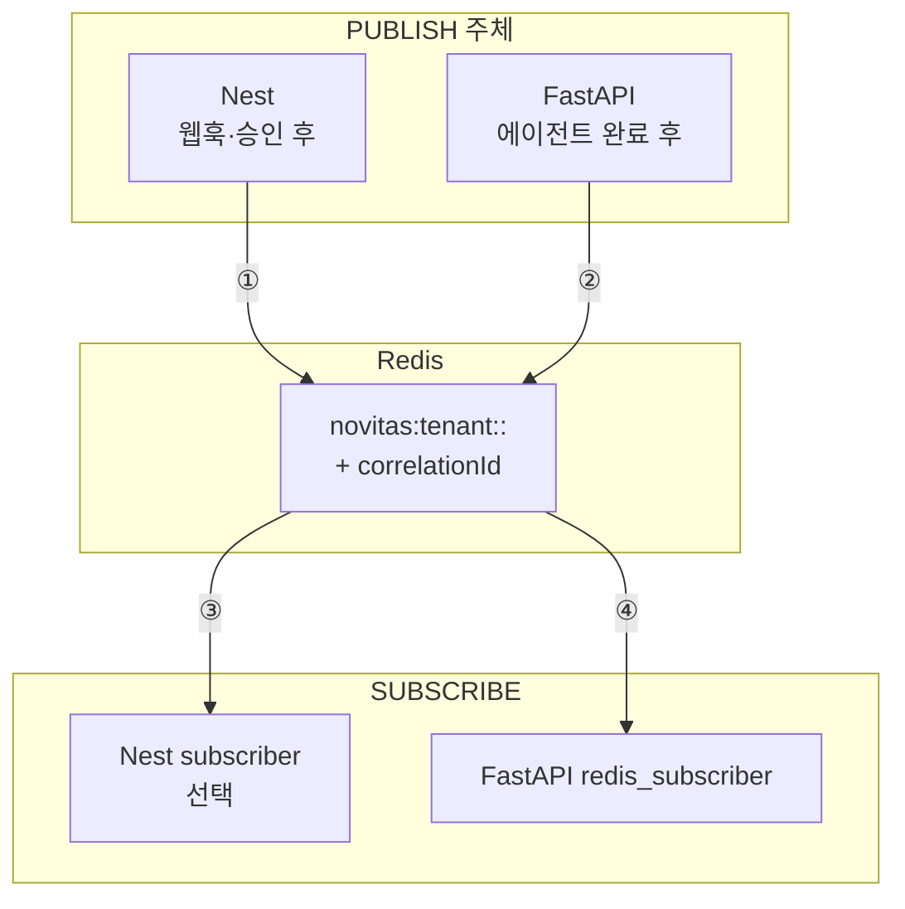

---

## 번호 매기기 규칙

- **각 절(1~8)의 `autonumber` / ①②③**은 그 기능 **안에서만** 순서를 나타낸다.
- **절 5**는 하위로 **5-1 수동·5-2 웹훅·5-3 자동**으로 나눈다.
