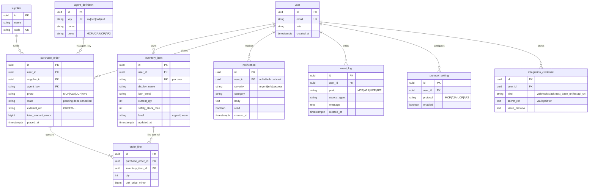

[sample-data.md](sample-data.md)

**확장 시:** 멀티 테넌시(매장·팀)가 필요하면 `organization`을 두고 `user.organization_id`와 리소스의 `organization_id`를 넣으면 됩니다. 과금·구독은 `plan` / `subscription`을 `organization` 또는 `user`에 다시 연결하면 됩니다.
